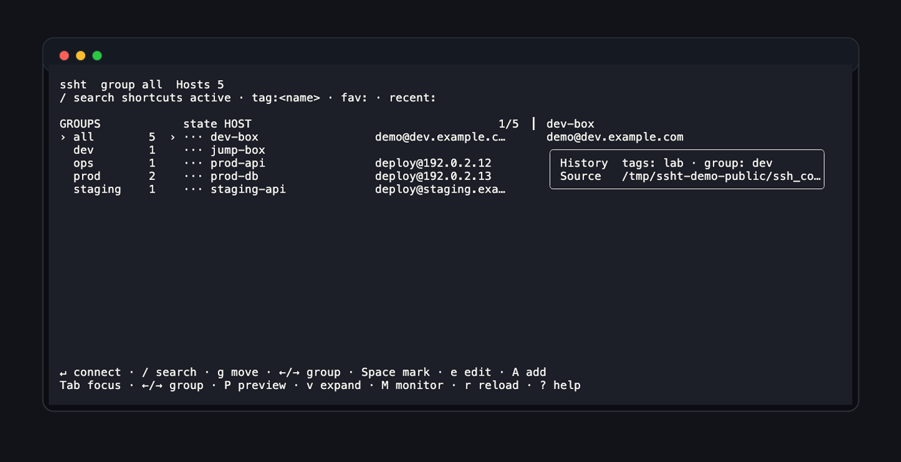

# ssht



`ssht` 是一个本地终端 UI，用来浏览 OpenSSH config 里的 `Host`，按分组筛选，并用当前系统终端打开 SSH 连接。

它只读取和维护 SSH config 中的主机条目，实际连接始终交给 OpenSSH：

```bash
ssh <alias>
```

`ssht` 不实现 SSH 协议，也不会保存密码、私钥或其他 SSH 凭据。TUI 设置只保存终端打开方式和界面偏好到本地状态文件。
终端后端设为 `auto` 时，会优先从当前运行 `ssht` 的终端打开连接。

## 安装

从 GitHub Release 一键安装，不需要本机安装 Go：

```bash
curl -fsSL https://raw.githubusercontent.com/Davied-H/ssht/main/scripts/install-release.sh | sh
```

默认安装到 `~/.local/bin/ssht`。指定版本或目录：

```bash
curl -fsSL https://raw.githubusercontent.com/Davied-H/ssht/main/scripts/install-release.sh | SSHT_VERSION=v0.1.0 sh
curl -fsSL https://raw.githubusercontent.com/Davied-H/ssht/main/scripts/install-release.sh | INSTALL_DIR=/usr/local/bin sh
```

源码安装：

```bash
git clone https://github.com/Davied-H/ssht.git
cd ssht
./install.sh
```

## 快速使用

```bash
ssht
ssht --config ~/.ssh/config
ssht --print-hosts
ssht doctor
ssht --connect prod-api-01
```

常用键：

- `/`：进入搜索并编辑当前筛选
- `Ctrl+U`：在搜索中清空筛选
- `:` / `Ctrl+K`：打开命令面板
- `o`：打开设置弹窗，调整终端打开方式和界面偏好
- `Enter`：打开选中主机
- `Space`：标记主机，批量打开
- `[` / `]`：切换分组
- `g`：移动主机到分组
- `H`：查看本地连接历史
- `A` / `e` / `d`：新增、编辑、删除主机
- `?`：帮助
- `q` / `Esc`：退出

## 分组和标签

`ssht` 使用 OpenSSH 会忽略的注释保存分组和标签：

```sshconfig
# ssht: group=prod tags=api,critical
Host prod-api-01
    HostName 192.0.2.12
    User deploy
```

`group` 用于左侧分组，`tags` 用于搜索，例如：

```text
tag:api fav: user:deploy group:prod -db
```

也可以运行 `ssht doctor` 检查重复别名、解析 warning、无效端口等配置健康问题。

## 更多文档

- [完整使用指南](docs/usage.md)
- [Codex / Claude Code 配置](docs/usage.md#codex--claude-code)
- [Raycast 扩展](docs/usage.md#raycast-扩展)
- [发布和打包](docs/usage.md#发布和打包)
- [公开前检查](docs/usage.md#公开前检查)

打 tag 前跑一条仓库内命令：

```bash
sh scripts/preflight-release.sh
```

## Agent 配置

仓库带有 `AGENTS.md`、`CLAUDE.md` 和几个 Codex skills。安装到本机：

```bash
curl -fsSL https://raw.githubusercontent.com/Davied-H/ssht/main/scripts/configure-agents.sh | sh
```

本地 clone 后也可以直接运行：

```bash
sh scripts/configure-agents.sh
```
